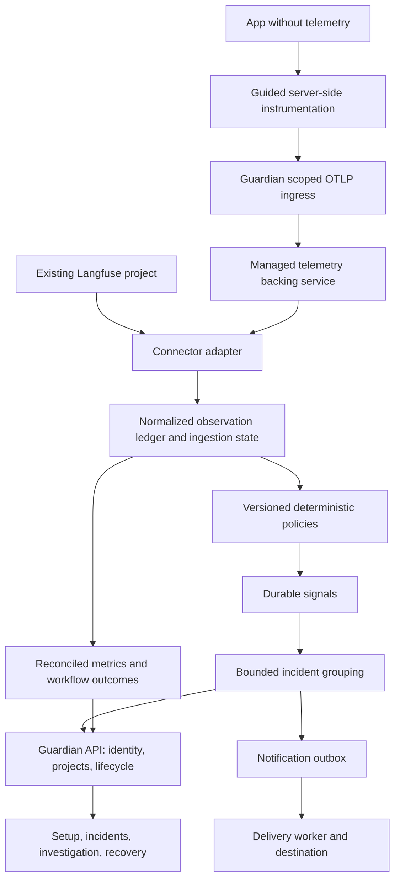

# Sillage: architecture

## Cream/brick identity and registration confirmation, ADR-53

The public and ordinary workspace builds share the same local typography, palette, original vector wake mark and named public brand assets. Font binaries compile into hashed static media; the backend snapshots only the fixed favicon/manifest/license filenames alongside manifest-listed assets, preserving file-size, traversal and immutable-snapshot boundaries. Container and CI build allowlists include these exact assets. [DESIGN_REFRESH.md](DESIGN_REFRESH.md) describes the visual contract.

The revised signup presents a normal registration form with required name/email and optional details under disclosure. Only the registration API's exact HTTP 202 committed acknowledgment permits an in-memory success page and replacement of the visible URL with `/waitlist`. The URL carries no personal data or success flag, and the route itself confers no authority. Direct/reloaded waitlist entry remains neutral. Existing storage/consent semantics and workspace OIDC authentication are unchanged.

## Public frontend and independent registration, ADR-52, 2026-09-14

The explicit Vercel public build serves the landing/demo, early-access form and privacy notice without mounting the workspace authentication lifecycle. Sign-in/onboarding call a same-origin Node availability function, which checks only the operator-configured HTTPS workspace's bounded `/api/ready` endpoint. Healthy readiness offers an explicit link to that workspace origin; missing configuration or failure keeps the visitor on the coming-soon/unavailable experience. Existing self-hosted builds retain their guarded routes, OIDC cookies and CSRF rules.

The separate registration function persists an unverified contact with explicit consent in a dedicated Mongo replica-set database. Contact identity is the normalized email. A majority-acknowledged transaction reserves bounded global/HMAC-IP rate counters and inserts the contact; duplicate active registrations preserve the original details and expiry. Fresh consent after logical expiry can start a new period. TTL indexes implement 180-day retention, with logical expiry enforced by export/registration even before asynchronous deletion. Public success is returned only after commit. No password, workspace identity, provider key, raw IP or telemetry is stored by this flow.

Index/schema bootstrap and private CSV export/single-contact deletion are separate operator commands. The browser build excludes local dotenv and server secrets. The monitoring API and workers remain persistent services; this deployment does not provision projects or move authentication across origins. [PUBLIC_LAUNCH.md](PUBLIC_LAUNCH.md) records the contract and deployment gates; [WORKFLOW.md](WORKFLOW.md) explains both journeys end to end.

## OpenTelemetry projection boundary, ADR-51, 2026-09-13

[OPENTELEMETRY.md](OPENTELEMETRY.md) records the contract for the 0.2.0 Python client before implementation. The standards path delegates wrapping to one selected OpenInference instrumentor and attaches `SillageSpanProcessor` to a provider. The launcher owns a private provider passed explicitly to that instrumentor; an application with an existing `TracerProvider` can attach the processor itself. Neither integration replaces the global provider, its sampler, or another processor/exporter. The Connections default selects this standards path explicitly; the CLI's unqualified default remains the native adapter for compatibility.

The processor projects only recognised ended LLM calls into the existing `BackgroundExporter.emit` contract. It preserves actual 128-bit trace IDs, 64-bit span and parent IDs and source timestamps; it does not call the helper that generates new IDs. Strict OpenInference/GenAI token aliases reconcile to nullable measurements. Cost stays unknown even if an upstream instrumentor supplies an estimate. Known provider scopes additionally require recognised text-generation function names because some upstream image calls are labelled LLM. HTTP, embedding, tool, retriever, chain and agent spans never become counted generations.

Agent attribution uses explicit technical `sillage.agent.name` / `gen_ai.agent.name`, the selected OTel context key, or a recognised AGENT ancestor available when the child ends. A process-local map retains at most 2,048 scalar context entries for 300 seconds; it never retains original spans or payloads. Late, remote or evicted context falls back to the service name. Parent IDs may therefore point to framework spans that this numeric collector does not store. Views expose that real reference without inventing a complete tree. For existing LiteLLM workflow metadata, the launcher's root ID generator derives the actual OTel trace ID from service name and legacy run ID using the documented SHA256 mapping in [OPENTELEMETRY.md](OPENTELEMETRY.md). An existing OTel parent takes precedence; projection never rewrites IDs or fabricates parent spans.

One selected SDK/framework layer prevents known instrumentation overlap. Existing distinct nested LLM span IDs are preserved with a bounded advisory; the processor does not guess that legitimate child calls are duplicates. Identical source-ID replay and changed evidence retain the existing ledger's idempotency/conflict behavior. Provider `OK` can still describe an interrupted stream: recognised OpenInference OpenAI/LiteLLM scopes require terminal evidence before reporting success; missing evidence remains unknown. Generic application-owned OTel `OK` is retained as reported operation success, never answer quality or workflow success.

Upstream privacy options hide supported content fields, while projection independently reads only explicit numeric/lifecycle/technical attributes and a bounded finish-reason list. It ignores arbitrary metadata, resource fields, exception events/descriptions and upstream price estimates. This in-process bridge still exports Sillage JSON, not OTLP; it adds no general receiver or full workflow-span store. Installed-wheel collector/worker checks passed; [VALIDATION.md](VALIDATION.md) records the final artifact, SDK matrix and product acceptance evidence. Run details distinguish unknown call outcomes from success and show actual parent references.

Upstream coverage has a second failure mode beyond unknown measurements: a call with no ended source span produces **no captured event**. Current installed-instrumentor acceptance observed four early-closed streams and one cancelled operation with no ended span. OpenAI Responses returns/completed streams/returned failure and successful LiteLLM returns lacked trusted terminal evidence and were captured with unknown outcomes; LiteLLM exceptions remained reported errors. The processor cannot reconstruct absent spans or parse private provider payloads to fill these gaps. Known terminal evidence and source completeness therefore remain separate facts; stream/cancellation coverage needs upstream repair or a separately verified compatible native/manual path.

## Native startup compatibility boundary, ADR-50

[INSTRUMENTATION.md](INSTRUMENTATION.md) extends the manual helper architecture with an installable Python wheel and process-local SDK hooks. `sillage-run` installs hooks before `runpy` enters the original script/module, so an application's `from litellm import acompletion` receives the observed callable. Existing callbacks remain intact. Version checks select tested surfaces; a context variable prevents nested LiteLLM/OpenAI double capture. Each application fallback attempt stays distinct. The same bounded exporter and numeric event schema feed the collector, worker, ledger and views. No source switch, fingerprint migration or new datastore is required.

The protected `/api/guardian/integrations/python.whl` route serves one fixed, bounded artifact. The image builds it in a separate Python stage from an explicit package-source allowlist. The local equivalent is [the wheel builder](../packages/sillage-python/build_wheel.py). Existing helper ZIPs remain available for manual Python/Node integrations. No artifact embeds deployment credentials.

The Connections default is create key → install/configure/run → verify a real processed call, with testing as an optional diagnostic. Local `--check` reports configuration/adapter availability and explicitly does not verify the collector. The original Founder Path runs `LlmChat` through LiteLLM, with optional legacy Langfuse callbacks; a direct-mode Sillage deployment reads only its own collector. Merely starting both applications never connects these sources. Raw content, full RAG hierarchy, OTLP admission and subprocess coverage remain outside this boundary.

## Product experience boundary, 2026-09-13

The public `/welcome` and `/demo` routes mount a static, deterministic React experience before the authenticated application lifecycle. They do not bootstrap identity, read private APIs, create sessions or send telemetry. Real navigation to `/signin` or `/setup` enters the existing verified access boundary and preserves the OIDC callback/deep-link contract. The backend explicitly serves these known UI paths without relaxing API authentication or traversal checks. Sample state is browser memory only.

The responsive application shell retains existing routes and permission ownership. **Connections** replaces the Setup label, with three primary steps, optional diagnostics and explicit receipt/processing evidence. Its helper download is a protected GET: fixed Python/Node file allowlists produce a ZIP containing the exact shipped modules and instructions. No secret or deployment configuration is embedded. The container includes those same six source files; `GUARDIAN_INTEGRATIONS_DIR` points to the packaged directory.

Overview loads the 24-hour source view independently from processed accounting and incident summaries. Direct mode reads committed numeric call records; the connection inbox can therefore show a receipt before the worker makes that call visible. Langfuse mode reads the configured source for recent activity while the worker owns durable rollups. Current worker heartbeat, pending receipts, historical data and missing costs remain different facts. Failed calls retain measured duration, including zero. [EXPERIENCE.md](EXPERIENCE.md) records the decision sequence and [BRAND.md](BRAND.md) the compatible Sillage rename.

Updated 2026-09-12 after bounded R1 repairs, R2 named access/native capture, R3 monitoring rules and durable Slack delivery. Current runtime and local verification boundaries are described below; managed onboarding, workflow outcomes, grouped response and deployment lifecycle remain target design. Cutover/recovery, production query/load validation and the full release gates remain open.

## Current runtime

The deployment boundary recorded before code in [DEPLOYMENT.md](DEPLOYMENT.md) is now implemented: one image definition contains the production static frontend and API, with separate role processes for intake analysis and optional delivery. An explicit transactional bootstrap establishes matching direct/OIDC bindings and indexes; a bounded read-only readiness route reports configuration/database readiness independently of process liveness or worker/application activity. External TLS ingress, an authenticated replica-set database and an operator-registered OIDC client remain deployment dependencies. [Operator commands](../deploy/guardian/README.md) and [verification evidence](VALIDATION.md) distinguish native execution, image build and deployed acceptance. Packaging retains the current isolated-project model.

The provider boundary is now explicit under [PROVIDERS.md](PROVIDERS.md): application-owned OpenAI SDK operation -> Python/Node usage helper -> existing background exporter -> unchanged version 1 intake/ledger -> rule evaluation -> incident and notification. The helper reads only stored lifecycle fields and strict numeric usage, forwards original results/chunks/errors, and retains bounded scalar streaming state until terminal completion or cancellation. API credentials, request content and provider retries stay with the application. The manual helpers introduce no SDK monkey-patching; ADR-50 adds version-checked startup hooks separately. Neither path estimates cost or migrates canonical fingerprints. Setup supplies the language/API/stream recipe; actual SDK fixture evidence and deployment limits are recorded in [VALIDATION.md](VALIDATION.md).

Durable Slack delivery follows [NOTIFICATIONS.md](NOTIFICATIONS.md), recorded before implementation. A named owner tests and activates an operator-held destination; the existing ledger transaction inserts one deterministic delivery only when it creates an incident. A separate `notifications.worker` process admits a bounded HTTP attempt under a destination lease, records acceptance/retry/unconfirmed outcomes with fenced completion, and exposes recent history plus heartbeat through authenticated APIs. Receiver rate limits apply to the whole destination. Secrets remain in process configuration; immutable payloads contain only fixed categories/severity, opaque IDs and a Guardian link. Resolution does not recall a message. Broader lifecycle notifications and generic webhooks remain planned.

The current customer-facing continuation is [monitoring rules](POLICIES.md): fixed-project owner saves, compare-and-swap revisions and redacted audit share the existing identity/Mongo boundary. Before evaluating an observation, the ledger pins one validated policy snapshot in a transaction that touches the lease and policy head. Later changes apply to unpinned work; retries and historical incidents retain their original decision. Absolute cost/latency checks do not require a statistical baseline, and the existing incident/run/resolve path presents their evidence.

The R2 client boundary is implemented under the contract recorded before code in [EXPORTING.md](EXPORTING.md): a bounded per-process queue, one sender, immutable attempts, explicit call completion and flush/unconfirmed diagnostics. It uses the same Guardian JSON version 1 intake and changes no ledger or tenant model. In-memory client acceptance is distinct from the API's durable receipt and from completed analysis. Node cancellation and Python's non-interruptible in-flight socket/DNS limits are explicit; neither is a durable local spool. Python synchronous/asynchronous helpers and Node awaited/stream helpers preserve provider results, failures and chunks without inspecting content or inferring prices. Local wire and actual API/Mongo evidence is in [VALIDATION.md](VALIDATION.md).

```mermaid
flowchart LR
  App["Founder app or instrumented app"] --> LF["Customer Langfuse"]
  LF --> Adapter["Observations v2 HTTPX / shared normalizer"]
  Adapter --> Worker["Guardian polling worker"]
  Worker --> Ledger["Fenced page transaction: ledger / quarantine / work / continuation"]
  OTelApp["App with one OpenInference layer / existing OTel"] --> Processor["SillageSpanProcessor: recognised LLMs, real IDs, numeric projection"]
  Processor --> Native
  Native["Application terminal-call JSON"] --> Intake["Scoped write-only key / bounded intake"]
  Intake --> Inbox["Atomic durable receipt / numeric inbox"]
  Inbox --> DirectWorker["Direct worker / ledger and inbox acknowledgement transaction"]
  DirectWorker --> Ledger
  Ledger --> Materialize["Rebuild buckets / process durable rules"]
  Materialize --> Mongo["Mongo replica set: rollups / stable incidents / health"]
  Materialize --> Outbox["Atomic incident-created delivery outbox"]
  Outbox --> Delivery["Separate leased notification worker"]
  Delivery --> Slack["Verified Slack destination"]
  Delivery --> Mongo
  Mongo --> API["Guardian API :8001"]
  Adapter --> Live["Live views / bounded memory cache"]
  Live --> API
  API --> UI["React dashboard :3001"]
```

The services are separated: Founder backend/frontend run on 8000/3000; Guardian on 8001/3001. Guardian pins one capture mode and Mongo database per isolated project. Default `GUARDIAN_CAPTURE_MODE=langfuse` supports local `api_key` or named `oidc` access; explicit `direct` requires OIDC and accepts terminal-call metrics without a Langfuse account or client. Both paths use the observation ledger, deterministic detectors and derived metrics, but a deployment cannot ingest both modes into the same database. The shared capture-binding write fences concurrent first claims; conflicting existing data requires explicit migration or a fresh isolated database.

In Langfuse mode, default `LANGFUSE_READ_API=v2` uses HTTPX without constructing an exporter SDK; explicit `v1` retains SDK2 for supported legacy sources. There is no automatic fallback. Live/run views use observations rather than trace-list/get calls. Mongo contains numeric observations, quarantine/work/page state, lease, derived hourly buckets, stable incidents and monitoring state, plus identity binding, hashed sessions, expiring login state and redacted actor audit. Langfuse live previews still process content in memory and return it to browsers. Direct views read only the numeric ledger and expose no vendor links or content previews.

Good boundaries to preserve: source adapter, pure detectors, incident store interface and independent deployability. Current limitations are in [REVIEW.md](REVIEW.md), especially F01-F06 and F12-F13.

## Named access within the isolated deployment

[ACCESS.md](ACCESS.md) records the original R2-03 entry/recovery contract; [IDENTITY.md](IDENTITY.md) extends it with the opt-in OIDC mode agreed before code. Auth configuration is discovered before consulting browser keys. Local `api_key` mode retains its header/Bearer contract and data-independent access check. OIDC mode accepts only an opaque cookie session, checks current configured membership and the database binding, and returns actor/project/permissions plus a session-bound CSRF token. A summary/source failure does not reject access; an identity database failure returns unavailable without shared-key fallback. All Guardian responses use no-store and credential/Origin-dependent Vary.

OIDC uses code flow with S256 PKCE, nonce and browser-bound one-use state, followed by an eight-hour absolute application session. Only the opaque token hash is stored; expiry is checked explicitly, while TTL indexes clean up short-lived records. Production cookies are Secure, HttpOnly, SameSite=Lax and use the `__Host-` prefix. Provider tokens are discarded. Actor identity is verified issuer plus subject; owner/operator/viewer roles and display labels come from the operator allowlist and are re-evaluated on access. Membership changes require consistent configuration and process restart across replicas.

Organization/project/environment/connection/issuer/client ID are pinned atomically in `guardian_state`; a mismatch or incompatible ledger connection refuses access. Browser project/role claims cannot select another scope. This protects the configured isolated deployment against accidental reassignment, but does not prove ownership of a vendor project or provide shared-tenant routing. Direct-ingestion keys inherit this binding. Project creation, invitations/member administration and managed provisioning remain planned.

Cookie mutations require the exact configured UI Origin and session CSRF token. Viewers cannot resolve incidents. Resolution rechecks and writes the session/binding inside the Mongo transaction, conditionally changes an open incident and inserts one deterministic actor/project/action audit event. Concurrent replay preserves the first timestamp and actor; an already-resolved legacy record gains no invented audit. Logout deletes the server session with majority acknowledgement and conflicts with its transactional authorization write. Real local Mongo checks cover both race orderings, audit failure rollback, session rotation rollback and uncertain commit recovery; they do not establish multi-node failover.

The browser keeps OIDC actor/project/CSRF in memory and does not send stored development keys. Login return paths are locally validated; server callbacks use only fixed configured destinations. Logout immediately hides protected views and reports failure with retry until server revocation is confirmed. Local key disconnection still only clears browser storage. Setup reports observed configuration/progress without claiming managed capture or activation. Callback queries are removed from application access logs; deployed proxy/TLS behavior and provider registration still require validation. Current evidence is maintained in [VALIDATION.md](VALIDATION.md).

## Native numeric capture implemented within R2

[CAPTURE.md](CAPTURE.md) defines a strict versioned JSON endpoint for completed calls. Stable IDs, aware start/end timestamps, explicit status and allowlisted numeric cost/token fields enter the same normalized ledger. Unknown measurements remain unknown; raw prompts, responses, arbitrary metadata and caller-selected project scope are rejected. This is a bounded application export contract, not an OTLP collector, raw trace database or automatic RAG instrumentation.

An owner creates/revokes write-only ingestion keys using the current session, exact Origin and CSRF. Each mutation rechecks/touches owner authority and identity/capture binding within the same transaction as the credential and redacted audit. Full secrets appear only in the creation response; storage retains a hash and public metadata. Operator/viewer roles can inspect redacted status. Keys are project credentials independent of human sessions: creator logout does not stop capture; expiry or explicit revocation does. A repeated creation request UUID returns a conflict without disclosing the secret again.

Intake authenticates only `X-Guardian-Ingest-Key`. Credential/binding writes, fixed-window admission quotas, the idempotent batch receipt and proposed numeric inbox records commit together with majority acknowledgement. A rejected quota/backlog request leaves no partial admission. Identical batch replay returns its receipt while the key remains valid; changed content under that batch ID is rejected. Across batches, identical observation copies add no work, while changed copies enter conservative conflict handling. Revocation conflicts with admission's credential write; accepted history survives later revocation.

HTTP 202 establishes receipt, not completed analysis. Test-mode batches update separate handshake state and never enter production totals/detectors. The direct worker drains up to 500 records per cycle in transactions of 100; ledger acceptance and inbox acknowledgement are atomic. It processes a fixed admitted sequence boundary rather than asserting upstream completeness. It does not retroactively reevaluate completed statistical decisions when earlier events arrive later. Setup and direct views distinguish pending, processed, conflicted and stopped/stale worker states. Missing content means this mode cannot perform source-output PII scanning.

Bounds include 100 events/256 KiB per batch, 10 active/100 retained credentials, 10,000 pending inbox records and 1,000 records per direct live/run view. Quotas, timestamp limits and exact replay semantics are recorded once in CAPTURE. These admission limits do not establish sustainable throughput. Receipts, inbox records, keys and audit history remain retained; expiry is enforced without treating TTL cleanup as authorization. Real localhost Mongo checks exercise rollback, quota/revocation/source-mode races and actual HTTP intake through metrics and incident creation; deployed TLS, retention and customer instrumentation remain release work.

## Verification boundary implemented in R0-01

A standard-library parent launches one app per subprocess using an explicit interpreter, isolated import path and allowlisted environment. It does not import either app. Local `.env` auto-loading is disabled in children. Guardian binds an ephemeral loopback socket; the parent tests its actual HTTP header authentication, including missing/wrong-key and obsolete-cookie rejection. Parent-owned children are terminated on timeout or interruption.

Offline mode feeds six synthetic baseline observations plus one anomaly through the real worker/detector/store classes with mongomock persistence. It tests component integration and HTTP, not real source delivery, database concurrency or a browser. Live mode requires a dedicated test Langfuse project and separate test-named Mongo databases, validates access before model calls, attributes worker candidates to the generated runs and reconciles rollups. It never deletes data to make verification pass. A live run does not promise an organic anomaly or customer outcome.

R0-01 changed verification infrastructure without a production deployment or schema migration. See [tools/README.md](../tools/README.md) for its runnable contract and [VALIDATION.md](VALIDATION.md) for evidence. Both frontend templates omit unused third-party script injection and template analytics. Shared-key browser storage now belongs only to local compatibility mode; content-preview privacy remains unfinished R2 work.

## Bounded R1 boundary implemented locally

[TELEMETRY.md](TELEMETRY.md), [SOURCE_MIGRATION.md](SOURCE_MIGRATION.md) and [INGESTION.md](INGESTION.md) define the implemented contracts. The shared normalizer requires stable observation/trace identifiers and an aware source start time, normalizes UTC, retains optional timing/attribution and produces `revision_fingerprint`. The ledger uses a separate canonical connection/source/project/trace/observation key for identity; the fingerprint distinguishes identical copies from conflicts, not ordered revisions. Missing measurements remain absent; invalid identity/time produces a rejected disposition.

`fetch_generations` returns complete/partial/failed, fixed bounds, source API version and safe diagnostics for live/compatibility reads. The v2 worker uses single-page results with one accepted/quarantined disposition per row, including duplicates. V2 follows opaque `meta.cursor` values with 100-row requests until absent/null; a short page with a cursor is not exhausted. Malformed envelopes/cursors cannot advance progress; row-level quarantine is durable separately from envelope validity. Continuation tokens stay internal and are excluded from API/log output. Exhaustion describes the accessible query, not settled arrival of delayed telemetry. Explicit v1 retains bounded offset pagination.

V2 streams at most 8 MiB per response, uses a 15-second traversal budget and at most five seconds per network timeout, and disables retries, redirects and ambient proxies/credentials. Worker/API source work uses a four-slot executor per process with a 20-second caller deadline. Timeout/cancellation retains the slot until the real thread finishes; excess work is rejected instead of queued without limit. These are bounded synchronous network stages, not hard thread cancellation. Shared source-quota coordination across processes is not implemented.

V2 requests identity response encoding and rejects other encodings before decompression. A live traversal is bounded to ten requests; the worker reads up to five pages per poll and resumes durable continuation in later polls. Page-budget exhaustion is visible rather than reported as completed history. Contradictory cost/token measurements are unknown and follow explicit source disposition/quarantine rules; cost tolerance is specified in SOURCE_MIGRATION. Logs retain only the fixed v2 method/path and numeric status, excluding provider-controlled reason phrases.

V2 measurement projection precedes shared normalization. Present `usageDetails`/`costDetails` maps are authoritative even when empty or partial; generated scalar zeros cannot establish coverage. Explicit detail zero remains known. Exclusive cached/reasoning/custom buckets participate without counting the same token twice, and transport parses numeric JSON with Decimal precision. The ledger preserves exact source cost text alongside the operational numeric value; public totals still do not claim invoice precision.

Every new worker traversal rereads 24 hours; identity selects new observations rather than an event-time filter after the previous cursor. Initial import accounts for all captured history in that window. Each v2 page transaction commits accepted/quarantined dispositions, ledger changes, pending work, receipt and continuation. Only a terminal page advances the source watermark. A checkpoint older than the supported horizon stops with `checkpoint_outside_window`; there is no automatic historical gap skip. Legacy v1 writes only complete windows within its 500-row bound. Authenticated monitoring exposes source and processing progress independently of API liveness.

Live views aggregate up to 1,000 accepted source observations before limiting displayed feed rows. They expose partial/failed/stale coverage and retain original fetched time when serving stale data; cache expiry uses monotonic time. Run lookup accepts 1–168 hours, defaulting to 168. Complete empty reads return HTTP 200 with `not_observed` within those bounds, not global trace absence. Without usable cached data, run source failures return 503; cold live snapshot failures retain HTTP 200 with degraded coverage and null statistics. Runs group child observations and available trace context; conflicting context stays unknown, and child measurements establish neither workflow success nor whole-run duration.

Unknown costs/tokens produce nullable totals with known subtotals/counts; known latency has its own denominator. Invalid aggregate ranges produce explicit issues instead of non-JSON numbers. Ledger buckets expose `ledger-1` accounting and conflict coverage. Existing incremental rows remain legacy/provisional and block an unsafe writer cutover. More than 5,000 matching hourly buckets produces HTTP 422 rather than silent truncation. The separate incident overview/trend raw-row caps are now removed through database aggregation under [SUMMARIES.md](SUMMARIES.md).

Local source/worker/store/API and UI tests exercise these boundaries. Browser tests use synthetic API responses. Dedicated localhost replica-set verification is recorded separately in [VALIDATION.md](VALIDATION.md); mock tests do not establish atomicity, and a single-node test does not establish production failover. All seven original review assertions now pass, including the known-zero-baseline transition. Legacy cutover/backup/rollback, high-volume recovery, retention, real source compatibility and customer onboarding remain open.

The default reader has migrated to v2, but actual source/exporter compatibility remains unverified. Explicit v1 is intended for self-hosted v3 and temporary Cloud rollback; Cloud removes legacy reads on **2026-11-16** and self-hosted v4 does not provide them. Founder still uses SDK2 ingestion. Older ingestion may take up to 15 minutes to appear in v2, beyond the short live harness window. Exporter migration and live compatibility evidence remain R1-01 prerequisites before beta. [Source migration and primary references](SOURCE_MIGRATION.md).

## Target: same product for two telemetry journeys

Langfuse remains the existing-source adapter and a candidate raw-telemetry backing system for future managed instrumentation. The implemented native JSON path narrows that initial dependency: terminal-call metrics can reach Guardian directly without a Langfuse account. It does not implement the broader OTLP/managed path in this target diagram. Any managed backing deployment still must pass R0-03 for terms, provisioning, regional controls, support, cost and disclosure. Neither operator-managed Cloud nor operator-hosted Langfuse is already provisioned. Do not expand the numeric inbox into a custom raw trace database.

Langfuse supports OTLP ingestion and organization/project administration APIs, but version, plan and permission compatibility must be checked in the provisioning spike. [OTLP migration](https://langfuse.com/integrations/native/opentelemetry/migration-to-v4), [administration API](https://langfuse.com/docs/administration/scim-and-org-api).

## Deployment and isolation

- **Local development:** existing shared key remains a development mechanism.
- **Assisted beta:** one isolated Guardian deployment/database and chosen capture mode per customer organization; Langfuse mode also has its own backing telemetry project. OIDC named sessions, fixed binding, resolve audit and direct write-only keys are implemented locally; validate actual provider/TLS operation and complete access/privacy gates. Provisioning can be operator-assisted behind the setup workflow; capture its time/cost.
- **Paid self-service:** shared control plane only after tenant-isolation tests cover API, background work, aggregation, caches, exports, notification routes, retention and backing-service mapping.

Assign `organization_id`, `project_id` and `environment` at authenticated boundaries. Never trust a body/header tenant claim as authority. Ingestion keys map server-side to a project/environment; browser sessions map to memberships. Every store/read-model interface requires scope, including any future cache key. Separate databases alone do not replace authorization.

Owner/operator/viewer roles, maintained-library OIDC verification, HttpOnly sessions, CSRF/Origin checks and explicit CORS form the isolated named-access foundation. Keep Langfuse and notification credentials server-side in a secret manager. Direct-ingestion tokens are now revocable, hashed at rest and independent of human sessions; customer exporters must hold them server-side.

The customer app continues calling its provider directly. Guardian ingestion keys are not provider keys. An inline model proxy or enforced spending limit would require a different reliability boundary and is deferred.

## Capture contract and safe defaults

Initially support tested Python and JS/TS server runtimes. Reuse maintained OpenTelemetry/integration libraries and provide Guardian setup recipes; avoid reimplementing every provider SDK. Export asynchronously with bounded memory, timeout/retry, jitter and graceful flush. Exporter failure must not fail an application request. Expose dropped/rejected observations so fail-open behavior is visible.

The ingress authenticates, enforces payload/rate/cardinality limits, validates permitted attributes, assigns scope, strips forbidden content and forwards to a project-bound collector/exporter. Use standard collector components where possible; pilot routing can be explicitly provisioned per project. Do not assume a standard collector alone solves dynamic tenant credential routing.

Default capture excludes prompts, responses, retrieved documents, tool arguments, email/user identifiers and provider error bodies. Capture necessary metrics and allowlisted metadata. Any content mode needs a separate consent/retention/access policy, SDK-side redaction before export and deletion coverage. OpenTelemetry explicitly documents sensitive-data handling processors; redaction must be verified with fixtures. [Sensitive data handling](https://opentelemetry.io/docs/security/handling-sensitive-data/).

## Normalized data contracts

The table below describes the complete target data model. R1-02 implements connection-scoped ingestion state, numeric observations, dirty/detector work, derived hour/agent rollups and stable finding/incident insertion. R2 adds a fixed deployment binding, operator-configured membership, hashed sessions, action audit, capture-mode binding, hashed ingestion keys, batch receipts and a numeric inbox. R3 adds per-call policy revisions and pinned observation snapshots, plus notification settings, command receipts and durable delivery records with bounded attempt history. Persisted membership administration, workflow summaries, grouped lifecycle and feedback records remain planned. Ledger/delivery event times use UTC database dates; fixed-query bounds retain ISO strings to preserve source-query precision, as do existing hourly keys. Keep display timezone separate.

| Record | Key/content | Purpose |
|---|---|---|
| Organization/project | Server IDs, membership, environment, status, limits | Scope and lifecycle |
| Telemetry connection | Scope, source type/region, secret reference, capabilities, state | Managed and BYO use one abstraction |
| Ingestion state | Connection, bounded window, page cursor, watermark, last success, lag, retry state, lease | Durable/recoverable progress |
| Observation metric | Scope + source + trace ID + observation ID, source fingerprint and capability-specific version evidence; parent IDs, kind, times, workflow, model, known costs/usage, outcome metadata | Idempotence, attribution, replay; no raw content |
| Workflow summary | Scope + trace/run ID; terminal outcome, attempts, component totals, coverage | Cost per run/outcome and actual run health |
| Rule version | Scope, type, thresholds, cohort, schedule, owner, enabled/content mode | Reproducible policy |
| Signal | Scope + observation/window identity + measurement/rule version, evidence, source timestamps | Atomic deterministic finding identity |
| Incident | Scope + grouping key/window, linked signals, severity, first/last seen, owner, lifecycle, recovery state | Customer response unit |
| Incident event | Actor/system, action, reason, timestamp, before/after | Audit and timeline |
| Notification job | Scope, incident event, destination, attempt/next attempt, delivery state | Durable delivery |
| Hourly rollup | Scope, environment/workflow/model/kind/hour, version and coverage | Complete, replaceable aggregate |
| Feedback/outcome | Incident, usefulness reason, mitigation, measurement windows | Product evaluation |

Retain observed costs with source/pricing basis and an explicit unknown flag; do not convert missing to zero. Use Decimal-compatible monetary representation and defined rounding only at presentation. Do not claim invoice accuracy. Include input/output/cache/reasoning token categories when supplied; avoid counting parent workflow totals again with child costs.

Workflow, generation, embedding, retrieval and tool are distinct kinds. Retrieval duration/count and embedding spend are separate. Terminal application success/failure/partial/cancelled/unknown is not inferred from child log levels. A recovered failed attempt is evidence of retry cost, not automatically a failed business operation. Unknown metadata remains unknown.

## Ingestion and consistency invariants

These invariants are implemented within the bounds in [INGESTION.md](INGESTION.md). They do not establish unlimited source history, authoritative legacy revision ordering, automated migration or a production operating envelope.

1. Live typed results distinguish complete/partial/failed. V2 worker pages additionally account for every source row through accepted/quarantined dispositions. A failed envelope cannot become successful empty traffic.
2. Pin source bounds, API/normalization version and page size. Commit ledger/work/page continuation together. Query mismatch blocks; an invalid continuation can restart the original fixed query once. Raw cursors never appear in public diagnostics.
3. Reread the preceding 24 hours and count new identities, including all initial import history. Out-of-horizon checkpoints require explicit backfill. Actual source settlement/retention remains unverified; 24-hour overlap is not unlimited late-arrival recovery.
4. Canonical connection/source/project/trace/observation identity makes identical replay a no-op. Changed copies in either mode become durable conflicts, invalidate trusted measurements and dirty affected attribution buckets. Replaying the original copy cannot restore trust. Known-ID rejected rows also prevent a later valid-looking copy from silently clearing conflict evidence.
5. Require Mongo replica-set transactions without a production fallback. Each write transaction mutates the connection lease while checking owner, epoch and validity. Stale owners cannot commit data or health after takeover. Source HTTP and rule evaluation stay outside retry callbacks.
6. Rebuild affected hour/agent buckets from the ledger and replace them atomically with dirty-work completion. More than 10,000 contributing observations leaves the bucket dirty with degraded health; no truncated total is published. Conflicts retain explicit unknown coverage.
7. Defer all detector processing until the fixed traversal is exhausted; descending pages can deliver an older baseline after its candidate. Use earlier accepted same-agent observations in the preceding 24 hours, excluding the candidate itself. More than 5,000 baseline observations or a rule failure retains pending work. Versioned rule identities prevent repeated completed work.
8. Stable observation/rule/finding identity distinguishes two agents or two calls by one agent within a trace. Atomic insert-only incident persistence and work completion share a transaction; replay preserves human resolution. Later conflicts annotate evidence without changing lifecycle.
9. Source watermarks, processing completion and visible freshness are separate. Recover durable work after ingestion interruption, even when a new source read fails. Bounded work and deferred evaluation may accumulate backlog; load validation remains required.

The implemented design is at-least-once ingestion with idempotent materialization within these bounds. Its explicit bounded transaction loop retries ambiguous commit acknowledgement on the same transaction and reruns work only for qualifying transaction errors; this addresses the pinned Motor 3.3.1 helper boundary found during real database testing. [DECISIONS.md](DECISIONS.md) records the decision and [VALIDATION.md](VALIDATION.md) records actual fault results.

Persist only allowlisted identity, attribution, times, nullable numeric values and safe PII categories. Raw output/status messages and user/session/tag context are excluded. A failure preparing safe PII findings blocks page commit; numeric rule failures leave durable work. Legacy aggregates cannot prove identity and must not be mixed or overwritten automatically. Existing deployments need backup, a clean database/cutover decision, bounded source replay and reconciliation with rollback artifacts; this automation remains unfinished. Code rollback to the old incremental writer against ledger totals is unsafe.

## Metrics and rules

Telemetry summaries retain the coverage of their ledger or bounded live traversal: query bounds, observed/unknown measurements and source/processing freshness remain explicit. Incident counts use a separate database aggregation rather than a telemetry sample.

`GET /api/guardian/summary?days=14` returns open counts and fixed known severity/detector categories plus `unknown`, daily trends, query bounds and invalid-timestamp coverage from one aggregation stream. Recent-seven-day counts and trends use UTC calendar days including today, ending just before one captured request time rounded down to BSON milliseconds. Open totals count current status regardless of creation date; the time cutoff is not a historical open-state snapshot. The response does not claim Mongo snapshot isolation. Zero incidents do not establish healthy monitored traffic.

New incident writes preserve public ISO time and add `created_at_utc` as a BSON date with `summary_schema=1`; naive creation times are rejected. Legacy aware ISO strings and BSON dates convert server-side without rewriting records. Invalid, missing and naive dates make `/summary` coverage partial; compatibility `/overview` and `/trends` return 503 when they cannot express that incompleteness. Query errors/deadlines also return 503. Category/day groups are bounded, but exact counts can inspect all matching rows. Legacy conversion requires scanning historical candidates; indexes and a two-second aggregation execution budget do not establish production capacity. [SUMMARIES.md](SUMMARIES.md) owns the query/setup contract and [VALIDATION.md](VALIDATION.md) records mock versus real database evidence.

The incident list now separates loading, initial failure, successful empty results and failed refresh. Retry is available; retained results are labelled and limited to the same filter. List pagination, broader metric-query scaling and production query/index/load validation remain R1-03 work.

Baselines are cohort-specific: project/environment/workflow and, where meaningful, model or release. Keep enough samples; do not fragment into unusable cohorts. Compare robust relative-change candidates against simple absolute budget/error-rate rules on labelled data. Set materiality floors, warm-up status and expected-change suppression.

Track spend rate/volume, cost per known successful workflow, retry overhead, errors and latency separately. Any savings or impact estimate includes its denominator, observation coverage and comparison window. No percentiles computed by averaging hourly percentiles.

## Incident and delivery contract

Separate durable signals from grouped incidents. Group by scope, workflow, condition/failure family and a bounded episode window; preserve distinct affected agents/observations. Re-evaluation updates evidence and can escalate severity; it does not silently drop later signals.

Target lifecycle: open -> acknowledged -> resolved, with assignment and time-limited snooze, plus dismissed with reason. Reopening creates an audit event. Resolution action does not automatically establish recovery: recovery remains pending until adequate post-change traffic satisfies the policy.

Each incident shows facts, baseline/current comparison, impact estimate, limits, source evidence and a deterministic investigation checklist. Later AI hypotheses must be separately labelled and sourced.

Commit incident events and notification jobs atomically. A delivery worker handles retry/backoff, destination verification, rate limits, exhausted attempts and manual replay. Redact payloads; sign generic webhooks. Delivery is at least once and may duplicate after ambiguous remote responses; use stable delivery IDs/destination idempotency when supported. Notify on meaningful changes, with cooldowns, not every poll.

## API, operations and lifecycle

Target API surfaces: identity/membership; projects; managed provisioning/connections and diagnostics; read-only metrics/coverage; policy configuration; incidents/actions; notification tests/history; usage/export/disconnect/delete. Final paths and OpenAPI schemas are agreed in R0/R1 before UI work.

Separate liveness from API/database readiness and connection/worker/delivery health. A healthy API does not imply healthy monitoring. Add structured logs with correlation IDs, ingestion lag, quarantine/drop counts, detector failures, backlog, source 429s, API latency and notification delay. Run an external dead-man monitor for the worker.

Move synchronous upstream calls off the event loop or use a supported async client. Bound request parameters, pages, jobs and cache sizes. Coordinate source quotas across workers/API instances by organization/resource bucket; honor Retry-After. The existing assumption of 15 requests/minute per project is not universal. [Langfuse API limits](https://langfuse.com/faq/all/api-limits).

Proposed beta retention defaults: 7 days of normalized observations, 30 days of rollups/incidents, 90 days of redacted audit/delivery metadata. These are initial sizing targets to validate, not current behavior. Longer periods require economics and customer policy. Deletion cancels work, revokes keys, purges derived/backing managed data and caches, and documents backup expiry. For BYO, disconnect does not delete customer-owned Langfuse data unless explicitly requested under a separate supported operation.

Keep a modular backend plus API, ingestion/poll and delivery processes. Mongo durable jobs are sufficient initially. Add Kafka, a warehouse or Kubernetes only after a measured bottleneck. Plan PyMongo Async migration through the store interface and CRA migration to a maintained SPA build tool; pair with clean-install and regression evidence, not a framework rewrite.
