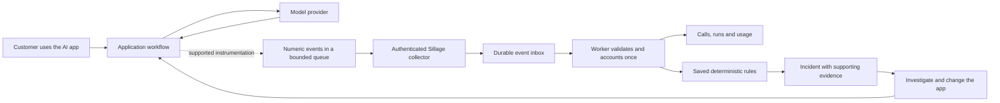
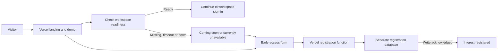

# What Sillage does, end to end

Sillage currently observes an application's LLM calls and applies deterministic rules to the measurements. Sillage does not itself call an LLM to explain incidents, generate recommendations or assess answer quality.

## A monitored application

1. The customer's application uses its existing model provider and credentials. Sillage is not a model proxy and does not change the model answer.
2. For supported Python interfaces, `sillage-run` installs the selected hooks before loading the original app. Existing OTel applications can attach Sillage's span processor to their own provider. Manual Python/Node integrations are also supported.
3. Instrumentation reports ended supported LLM calls: technical agent/service label, model, real available trace/parent context, start/end time, reported tokens and outcome. Direct capture excludes raw prompts, responses and retrieved documents. The launcher does not infer USD prices; missing measurements remain unknown.
4. A bounded asynchronous exporter sends events using a write-only application key. The collector validates scope and input, then acknowledges durable receipt. Acknowledgement means accepted, not yet processed. A crash can lose events still in the application's in-memory queue.
5. The worker processes accepted events through the existing ledger, prevents identical replay from increasing totals and quarantines contradictory evidence. It builds measurements and evaluates saved rules. Existing deployments poll on their configured interval; the dashboard is not a per-token stream.
6. The dashboard shows available calls, grouped runs, measurements, source/processing state and incidents. Grouping requires source context. Missing agent labels use a service fallback; missing parent spans do not become invented workflow steps.
7. A person investigates the incident, changes the application and inspects subsequent traffic. Recording a resolution does not itself repair the application or prove recovery. Optional configured Slack delivery follows the existing outbox/notification-worker path.

For an existing Langfuse project, Sillage reads the configured source API instead of receiving the same calls through the direct collector. That source follows its own polling and privacy contract. Choose one source path for the same dataset to avoid duplicate representations. A Langfuse account is not required for direct capture.

## What this does not cover yet

The current numeric store does not retain full agent, chain, tool or retrieval spans, retrieved documents, answer evaluations or a complete workflow tree. Some upstream OpenInference early-closed/cancelled calls produce no ended span and therefore no captured event. Some returned Responses/LiteLLM calls have an unknown outcome because terminal evidence is absent. A healthy backend or collector cannot establish complete upstream coverage. See [OpenTelemetry limits](OPENTELEMETRY.md) and [measured validation](VALIDATION.md).

## A public visitor before the workspace is available

Registration records contact interest with consent. It does not create a monitoring project, provision a workspace, generate LLM traffic or authenticate an account. The registration function and database operate independently of the monitoring backend. If registration storage itself is unavailable, the page explains that the details were not confirmed saved and allows a retry. [Public launch contract](PUBLIC_LAUNCH.md).
